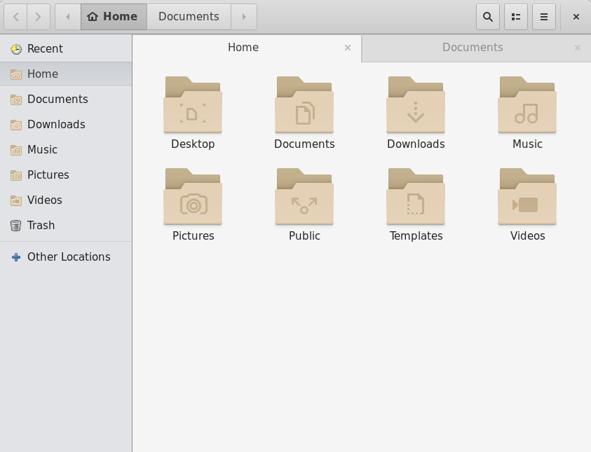

Patience
========
Gnome Theme
-----------

Patience is a modified version of Debian package v3.22.2-1 of Greybird grey GTK+ theme.

This project is licensed the same as Greybird: GPLv2 or later and CC-BY-SA 3.0 or later

Greybird project is hosted on Github: [Greybird Desktop Suite for Xfce](http://shimmerproject.org/projects/greybird/)

The Patience theme includes:
- Gtk+2 theme
- Gtk+3 theme
- Metacity theme

Dependencies for Gtk+2 support:
- gtk2-engines-murrine (>= 0.90)

The Gtk+3 theme uses the builtin engine and consequently has no dependencies.
